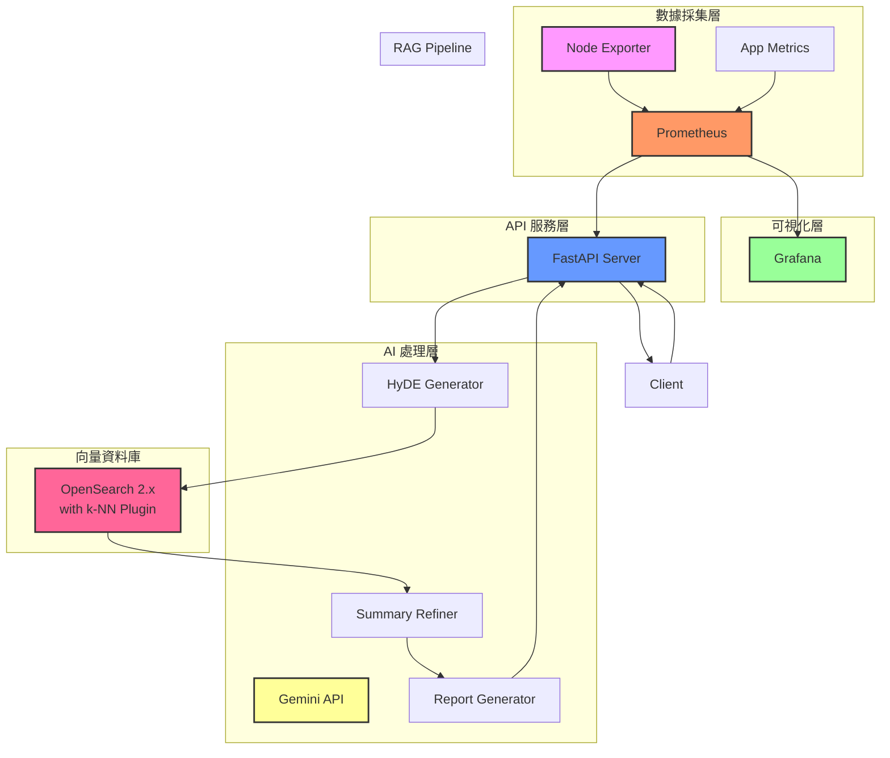

# AIOps 智慧維運報告 RAG 系統

一個基於 HyDE (假設性文件嵌入) 和摘要精煉技術的智慧維運報告生成系統，透過 RAG 架構自動分析監控數據並生成專業的維運報告。

## 🏗️ 系統架構



## ✨ 功能特色

- **🤖 智慧維運報告生成**：基於 HyDE + 摘要精煉的 RAG 架構
- **📊 多維度監控整合**：支援主機、網路、服務層級指標
- **🔍 向量檢索**：使用 OpenSearch k-NN 進行相似度搜尋
- **🚀 自動化部署**：GitHub Actions CI/CD Pipeline
- **🐳 容器化架構**：Docker Compose 一鍵部署

## 🚀 快速開始

### 前置需求

- Docker & Docker Compose
- Gemini API Key
- Python 3.9+

### 環境設置

1. **Clone 專案**
   ```bash
   git clone https://github.com/your-username/aiops-rag-system.git
   cd aiops-rag-system
   ```

2. **設定環境變數**
   ```bash
   cp .env.example .env
   # 編輯 .env 檔案，填入您的 Gemini API Key
   ```

3. **啟動服務**
   ```bash
   docker-compose up -d
   ```

4. **初始化 OpenSearch**
   ```bash
   python scripts/init_opensearch.py
   ```

## 📡 API 使用

發送監控數據以生成維運報告：

```bash
curl -X POST http://localhost:8000/api/v1/generate_report \
  -H "Content-Type: application/json" \
  -d '{
    "monitoring_data": {
      "主機": "web-prod-03",
      "採集時間": "2025-07-26T22:30:00Z",
      "CPU使用率": "75%",
      "RAM使用率": "95%",
      "磁碟I/O等待": "5%",
      "網路流出量": "350 Mbps",
      "作業系統Port流量": {
        "Port 80/443 流入連線數": 2500
      },
      "服務指標": {
        "Apache活躍工作程序": 250,
        "Nginx日誌錯誤率": {
          "502 Bad Gateway 錯誤 (每分鐘)": 45
        }
      }
    }
  }'
```

## 🔧 系統架構說明

### 1. 數據流程

1. **監控數據收集**：Prometheus 從各個 Exporter 收集指標
2. **API 接收請求**：FastAPI 接收包含監控數據的 POST 請求
3. **HyDE 生成**：使用 Gemini Flash 生成假設性事件描述
4. **向量檢索**：在 OpenSearch 中檢索相關歷史事件
5. **摘要精煉**：壓縮檢索結果，提取關鍵資訊
6. **報告生成**：使用 Gemini Pro 生成最終維運報告

### 2. 核心組件

| 組件 | 說明 |
|------|------|
| **Prometheus** | 時序資料庫，儲存監控指標 |
| **Grafana** | 監控數據可視化 |
| **FastAPI** | RESTful API 服務 |
| **OpenSearch** | 向量資料庫，支援 k-NN 檢索 |
| **Gemini API** | Google AI 模型服務 |

## 💻 開發指南

### 本地開發

```bash
# 安裝依賴
pip install -r requirements.txt

# 啟動開發伺服器
uvicorn src.main:app --reload --host 0.0.0.0 --port 8000
```

### 執行測試

```bash
# 設定 PYTHONPATH
export PYTHONPATH=$PWD

# 執行所有測試
pytest tests/ -v

# 執行特定測試
pytest tests/test_api.py -v
```

### 程式碼品質檢查

```bash
# 安裝開發工具
pip install flake8 black isort

# 執行 linter
flake8 src/ --max-line-length=127

# 格式化程式碼
black src/
isort src/
```

## 🚢 部署指南

### 使用 Docker Compose

本專案已配置完整的 docker-compose.yml，包含所有必要的服務：

```bash
# 建置並啟動所有服務
docker-compose up -d --build

# 查看服務狀態
docker-compose ps

# 查看日誌
docker-compose logs -f api
```

### 使用 GitHub Actions

本專案已配置 CI/CD Pipeline，會自動：
1. 執行測試
2. 建置 Docker 映像
3. 推送至 GitHub Container Registry
4. 部署至生產環境（需設定相關 Secrets）

需要設定的 GitHub Secrets：
- `GEMINI_API_KEY`: Gemini API 金鑰
- `DEPLOY_HOST`: 部署主機位址
- `DEPLOY_USER`: 部署使用者名稱
- `DEPLOY_KEY`: SSH 私鑰

## 📚 API 文件

啟動服務後，訪問以下網址查看互動式 API 文件：
- Swagger UI: http://localhost:8000/docs
- ReDoc: http://localhost:8000/redoc

## 📊 監控面板

| 服務 | 網址 | 預設帳密 |
|------|------|----------|
| **Grafana** | http://localhost:3000 | admin/admin |
| **Prometheus** | http://localhost:9090 | - |
| **OpenSearch Dashboards** | http://localhost:5601 | admin/admin |

## 🛠️ 故障排除

### 常見問題

1. **模組導入錯誤**
   ```bash
   export PYTHONPATH=$PWD
   ```

2. **OpenSearch 連線失敗**
   - 確認 OpenSearch 服務已啟動
   - 檢查防火牆設定
   - 確認 docker 網路設定

3. **Gemini API 錯誤**
   - 確認 API Key 正確
   - 檢查網路連線
   - 確認 API 配額

## 📝 授權

本專案採用 MIT 授權條款。詳細內容請參閱 [LICENSE](LICENSE) 檔案。

## 🤝 貢獻指南

歡迎提交 Issue 和 Pull Request！請確保：
- 遵循現有的程式碼風格
- 添加適當的測試
- 更新相關文件

## 📞 聯絡資訊

如有任何問題或建議，請透過以下方式聯絡：
- 提交 [Issue](https://github.com/your-username/aiops-rag-system/issues)
- 發送 Email 至：your-email@example.com