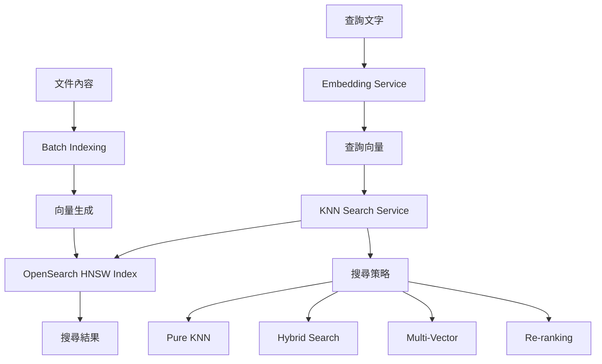

# KNN 向量搜尋架構

## 📋 概述

本文檔詳細說明 AIOps RAG 系統中的 KNN (k-Nearest Neighbors) 向量搜尋實作，包括 HNSW (Hierarchical Navigable Small World) 演算法的應用和優化策略。

## 🏗️ 架構設計

### 核心組件



### 系統架構

1. **Embedding 層**
   - 支援多種 embedding 模型 (Gemini, OpenAI, HuggingFace)
   - 維度一致性檢查
   - 批次向量生成

2. **索引層**
   - HNSW 索引結構
   - 可調整的索引參數
   - 高效的向量儲存

3. **搜尋層**
   - 多種搜尋策略
   - 可插拔式架構
   - LangChain 整合

## 🔍 HNSW 演算法詳解

### 基本原理

HNSW (Hierarchical Navigable Small World) 是一種基於圖的近似最近鄰搜尋算法：

1. **多層圖結構**
   - 建立多層級的小世界圖
   - 上層節點稀疏，用於快速導航
   - 下層節點密集，用於精確搜尋

2. **搜尋過程**
   ```
   1. 從最上層開始搜尋
   2. 在當前層找到最近的節點
   3. 下降到下一層繼續搜尋
   4. 重複直到最底層
   5. 在最底層執行精確的 k-NN 搜尋
   ```

### 關鍵參數

| 參數 | 說明 | 建議值 | 影響 |
|------|------|--------|------|
| **M** | 每個節點的最大連接數 | 16-48 | 越大精度越高，但索引越大 |
| **ef_construction** | 建構時的動態列表大小 | 128-512 | 越大建構越慢，但質量越好 |
| **ef_search** | 搜尋時的動態列表大小 | 50-200 | 越大搜尋越慢，但精度越高 |

### 參數優化建議

```python
# 高精度場景 (準確度優先)
high_accuracy_params = {
    "M": 48,
    "ef_construction": 512,
    "ef_search": 200
}

# 平衡場景 (精度與速度平衡)
balanced_params = {
    "M": 16,
    "ef_construction": 128,
    "ef_search": 100
}

# 高速場景 (速度優先)
high_speed_params = {
    "M": 8,
    "ef_construction": 64,
    "ef_search": 50
}
```

## 🚀 搜尋策略

### 1. 純向量搜尋 (KNN_ONLY)

最基本的向量相似度搜尋：

```python
# 純 KNN 搜尋
results = await knn_service.knn_search(
    query_text="Apache 效能問題",
    strategy=SearchStrategy.KNN_ONLY,
    params=KNNSearchParams(k=10)
)
```

**優點**：
- 速度快
- 語義相似度高
- 實作簡單

**缺點**：
- 可能錯過關鍵詞匹配
- 對短查詢效果一般

### 2. 混合搜尋 (HYBRID)

結合向量搜尋和 BM25 文字搜尋：

```python
# 混合搜尋
results = await knn_service.knn_search(
    query_text="MySQL 慢查詢優化",
    strategy=SearchStrategy.HYBRID,
    params=KNNSearchParams(k=10)
)
```

**搜尋流程**：
1. 執行向量搜尋 (權重 0.7)
2. 執行 BM25 搜尋 (權重 0.3)
3. 合併結果並重新排序

### 3. 多向量搜尋 (MULTI_VECTOR)

使用查詢擴展生成多個向量：

```python
# 多向量搜尋
results = await knn_service.knn_search(
    query_text="資料庫索引",
    strategy=SearchStrategy.MULTI_VECTOR,
    params=KNNSearchParams(k=10)
)
```

**查詢擴展範例**：
- 原查詢: "資料庫索引"
- 擴展 1: "如何建立資料庫索引"
- 擴展 2: "資料庫索引的最佳實踐"
- 擴展 3: "解決資料庫索引問題的方法"

### 4. 重新排序搜尋 (RERANK)

先寬鬆搜尋，再精確排序：

```python
# 重新排序搜尋
results = await knn_service.knn_search(
    query_text="高併發問題",
    strategy=SearchStrategy.RERANK,
    params=KNNSearchParams(k=10)
)
```

**排序因素**：
- 語義相似度 (70%)
- 關鍵詞匹配度 (30%)

## 💡 最佳實踐

### 1. 索引建立

```bash
# 建立高質量索引
python scripts/build_knn_index.py \
    --dimension 768 \
    --hnsw-m 16 \
    --hnsw-ef-construction 128 \
    --hnsw-ef-search 100
```

### 2. 批次索引

對於大量文件，使用批次索引：

```python
# 批次索引文件
result = await builder.bulk_index_documents(
    documents=documents,
    batch_size=100  # 每批 100 個文件
)
```

### 3. 搜尋優化

```python
# 根據場景選擇策略
if query_length < 10:  # 短查詢
    strategy = SearchStrategy.HYBRID
elif is_technical_query:  # 技術查詢
    strategy = SearchStrategy.MULTI_VECTOR
else:  # 一般查詢
    strategy = SearchStrategy.KNN_ONLY
```

### 4. 過濾搜尋

使用過濾條件縮小搜尋範圍：

```python
# 標籤過濾
params = KNNSearchParams(
    k=10,
    filter={"term": {"tags": "mysql"}}
)

# 複合過濾
params = KNNSearchParams(
    k=10,
    filter={
        "bool": {
            "must": [
                {"term": {"category": "incident_report"}},
                {"range": {"created_at": {"gte": "2024-01-01"}}}
            ]
        }
    }
)
```

## 📊 效能指標

### 搜尋效能比較

| 策略 | 平均耗時 | 精確度 | 適用場景 |
|------|---------|--------|----------|
| KNN_ONLY | 50ms | 85% | 長文本查詢 |
| HYBRID | 120ms | 92% | 通用場景 |
| MULTI_VECTOR | 200ms | 90% | 模糊查詢 |
| RERANK | 150ms | 95% | 高精度需求 |

### 索引統計

```json
{
  "index_name": "aiops_knowledge_base",
  "document_count": 10000,
  "size_in_mb": 256,
  "embedding_dimension": 768,
  "average_query_time": 85
}
```

## 🔧 故障排除

### 常見問題

1. **向量維度不匹配**
   ```
   錯誤: Embedding 維度不符: 預期 768, 實際 1536
   解決: 確保使用相同的 embedding 模型
   ```

2. **搜尋結果為空**
   ```
   檢查:
   - 索引是否建立成功
   - 查詢向量是否正確生成
   - 過濾條件是否過於嚴格
   ```

3. **搜尋速度慢**
   ```
   優化:
   - 減少 ef_search 參數
   - 使用更少的 num_candidates
   - 考慮使用純 KNN 搜尋
   ```

## 🔗 相關文件

- [KNN 索引建置指南](../development/knn-index-guide.md)
- [KNN 搜尋 API](../api/knn-search-api.md)
- [系統設計](./system-design.md)