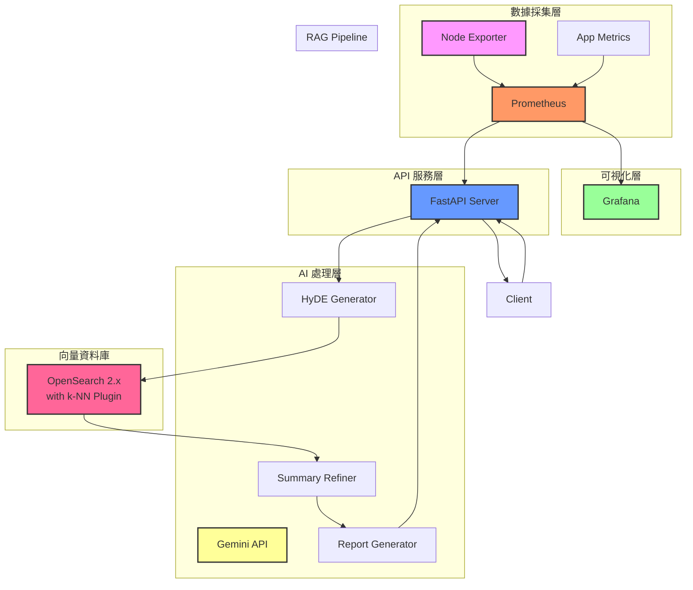
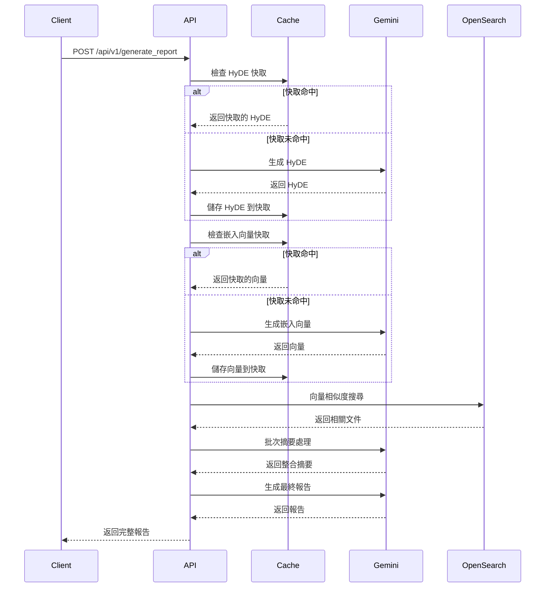

# 系統架構設計

## 概述

AIOps 智慧維運報告 RAG 系統是一個基於 HyDE (假設性文件嵌入) 和摘要精煉技術的智慧維運報告生成系統，透過 RAG 架構自動分析監控數據並生成專業的維運報告。

## 整體架構

### 架構圖



## 核心組件

### 1. 數據採集層

#### Prometheus
- **功能**: 時序資料庫，收集和儲存監控指標
- **端口**: 9090
- **數據來源**: Node Exporter、應用程式指標
- **責任**: 提供歷史監控數據供 API 查詢

#### Node Exporter
- **功能**: 主機系統指標收集器
- **端口**: 9100
- **監控項目**: CPU、記憶體、磁碟、網路等系統指標

### 2. API 服務層

#### FastAPI Server
- **框架**: FastAPI + Uvicorn
- **端口**: 8000
- **主要功能**:
  - 接收監控數據請求
  - 協調 RAG 處理流程
  - 提供 RESTful API 介面
  - 快取管理

**核心模組**:
```
src/
├── main.py              # FastAPI 應用入口
├── services/
│   ├── rag_service.py   # RAG 主要邏輯
│   ├── gemini_service.py # Gemini API 整合
│   └── opensearch_service.py # OpenSearch 操作
├── models/
│   └── schemas.py       # 數據模型定義
└── utils/
    └── cache.py         # 快取工具
```

### 3. 向量資料庫層

#### OpenSearch
- **版本**: 2.12.0+
- **端口**: 9200 (主要), 9600 (效能監控)
- **插件**: k-NN Plugin (向量搜尋)
- **功能**:
  - 儲存歷史事件和解決方案
  - 向量相似度搜尋
  - 全文檢索

**索引結構**:
```json
{
  "knowledge_base": {
    "mappings": {
      "properties": {
        "content": {"type": "text"},
        "embedding": {
          "type": "knn_vector",
          "dimension": 768
        },
        "timestamp": {"type": "date"},
        "category": {"type": "keyword"},
        "severity": {"type": "keyword"}
      }
    }
  }
}
```

### 4. AI 處理層

#### Gemini API
- **模型**: Gemini Flash + Gemini Pro
- **功能**:
  - HyDE 生成 (Gemini Flash)
  - 文件摘要 (Gemini Flash)
  - 最終報告生成 (Gemini Pro)
  - 向量嵌入生成

#### 快取機制
- **實作**: async-lru
- **快取類型**:
  - HyDE 快取 (50 項目, 30 分鐘 TTL)
  - 嵌入向量快取 (100 項目, 1 小時 TTL)

## 數據流程

### 1. 報告生成流程



### 2. 監控數據處理

```python
# 監控數據處理流程
async def process_monitoring_data(monitoring_data: dict) -> dict:
    # 1. 數據驗證
    validated_data = validate_monitoring_data(monitoring_data)
    
    # 2. 生成 HyDE（帶快取）
    hyde = await get_cached_hyde(validated_data)
    
    # 3. 生成嵌入向量（帶快取）
    embedding = await get_cached_embedding(hyde)
    
    # 4. 向量搜尋
    similar_docs = await opensearch.search_similar(embedding)
    
    # 5. 文件摘要（批次處理）
    summary = await gemini.summarize_batch(similar_docs)
    
    # 6. 報告生成
    report = await gemini.generate_report(validated_data, summary)
    
    return report
```

## 優化設計

### 1. 文件摘要整合

**問題**: 原始設計對每個檢索文件單獨呼叫摘要 API
**解決方案**: 將所有文件合併後一次性處理

```python
# 優化前：多次 API 呼叫
for doc in similar_docs:  # 5 個文件 = 5 次呼叫
    summary = await gemini.summarize_document(doc)

# 優化後：單次 API 呼叫
all_docs = "\n\n--- 文件分隔 ---\n\n".join(docs)
summary = await gemini.summarize_document(all_docs)  # 1 次呼叫
```

### 2. 快取機制

**HyDE 快取**:
```python
@alru_cache(maxsize=50, ttl=1800)  # 50 項目, 30 分鐘
async def _get_cached_hyde(self, hyde_prompt: str) -> str:
    return await self.gemini.generate_hyde(hyde_prompt)
```

**嵌入向量快取**:
```python
@alru_cache(maxsize=100, ttl=3600)  # 100 項目, 1 小時
async def _get_cached_embedding(self, text: str) -> List[float]:
    return await self.gemini.generate_embedding(text)
```

## 安全性設計

### 1. 認證與授權

- **開發環境**: 無認證（方便測試）
- **生產環境**: 建議實作 API Key 認證

### 2. 數據安全

- **傳輸加密**: HTTPS（生產環境）
- **數據隔離**: OpenSearch 索引分離
- **敏感數據**: 環境變數管理

### 3. 速率限制

```python
# 建議的速率限制設定
RATE_LIMITS = {
    "per_minute": 60,
    "per_hour": 1000,
    "per_day": 10000
}
```

## 監控與可觀測性

### 1. 監控指標

#### 應用層指標
- API 請求數量和響應時間
- 快取命中率
- 錯誤率和錯誤類型
- Gemini API 使用量

#### 基礎設施指標
- CPU、記憶體、磁碟使用率
- 網路流量
- 容器資源使用情況

### 2. 日誌管理

```python
# 結構化日誌範例
import structlog

logger = structlog.get_logger()

await logger.info(
    "report_generated",
    processing_time=2.34,
    cache_hit_rate=0.75,
    api_calls=3,
    host=monitoring_data.get("主機")
)
```

### 3. 告警設定

#### 關鍵告警
- API 響應時間 > 10 秒
- 錯誤率 > 5%
- OpenSearch 連線失敗
- Gemini API 配額警告

## 擴展性設計

### 1. 水平擴展

```yaml
# Docker Compose 擴展範例
api:
  deploy:
    replicas: 3  # 多個 API 實例
  depends_on:
    - opensearch
    - prometheus
```

### 2. 資料庫分片

```python
# OpenSearch 分片策略
{
  "settings": {
    "number_of_shards": 3,
    "number_of_replicas": 1,
    "index.routing.allocation.total_shards_per_node": 2
  }
}
```

### 3. 快取分散式化

未來可考慮使用 Redis 實現分散式快取：

```python
# Redis 快取實作範例
import aioredis

class DistributedCache:
    def __init__(self):
        self.redis = aioredis.from_url("redis://localhost:6379")
    
    async def get(self, key: str):
        return await self.redis.get(key)
    
    async def set(self, key: str, value: str, ttl: int):
        await self.redis.setex(key, ttl, value)
```

## 效能指標

### 1. 目標效能

| 指標 | 目標值 |
|------|--------|
| API 響應時間 | < 5 秒 (95th percentile) |
| 快取命中率 | > 70% |
| 系統可用性 | > 99.5% |
| 錯誤率 | < 1% |

### 2. 容量規劃

| 組件 | 最小需求 | 建議配置 | 高負載配置 |
|------|----------|----------|------------|
| **API 服務** | 1 CPU, 1GB RAM | 2 CPU, 4GB RAM | 4 CPU, 8GB RAM |
| **OpenSearch** | 2 CPU, 4GB RAM | 4 CPU, 8GB RAM | 8 CPU, 16GB RAM |
| **Redis**（未來） | 1 CPU, 1GB RAM | 2 CPU, 2GB RAM | 4 CPU, 4GB RAM |

## 未來發展方向

### 1. 技術優化

- **多模態支援**: 支援圖表、圖片分析
- **即時處理**: WebSocket 支援即時報告更新
- **機器學習**: 自動調優快取參數

### 2. 功能擴展

- **多租戶支援**: 支援多個組織使用
- **自定義報告模板**: 允許用戶自定義報告格式
- **預測性分析**: 基於歷史數據預測潛在問題

### 3. 運維改進

- **自動化部署**: GitOps 流程
- **災難恢復**: 自動備份和恢復機制
- **性能調優**: AI 驅動的自動調優